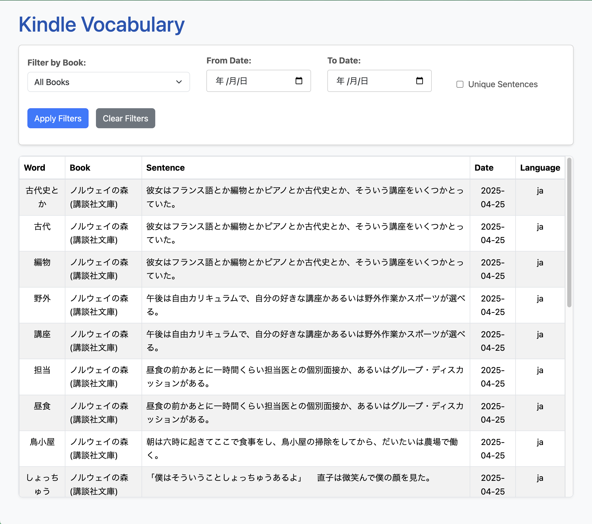

# kindle-vocab

Explore your saved vocabulary and dictionary lookups from your USB-connected Kindle!

## Motivation

With this program you can quickly revisit words that you looked up while reading on your Kindle.

From here you could easily create Anki flash cards with tools like:

- [Yomitan](https://yomitan.wiki/) (Open Source)
- [Migaku](https://migaku.com/) (Not Sponsored)

## Getting Started

Install `uv` via Homebrew if you don't yet have it: `brew install uv`.

1. `uv venv`
2. `uv pip sync pyproject.toml`
3. `uv run python main.py`

You should see some messages about waiting for a Kindle or serving at a URL depending on your setup. Default will be at http://localhost:11000.
